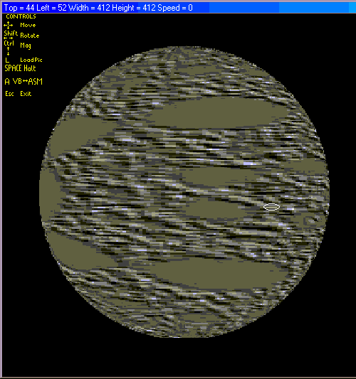



## Demo Spheroid Wrapping

### Description

Demo Spheroid Wrapping by Robert Rayment. This takes any bitmap & wraps it around a sphere. This can then be moved, rotated and magnified. The prog can be run with VB or machine code. Controls are keys only for this demo. Win 98 Zip file 85 KB.
 
### More Info
 
just run

             |
---                |---
**Submitted On**   |2001-12-15 08:25:58
**By**             |[Robert Rayment](https://github.com/Planet-Source-Code/PSCIndex/blob/master/ByAuthor/robert-rayment.md)
**Level**          |Advanced
**User Rating**    |5.0 (20 globes from 4 users)
**Compatibility**  |VB 6\.0
**Category**       |[Graphics](https://github.com/Planet-Source-Code/PSCIndex/blob/master/ByCategory/graphics__1-46.md)
**World**          |[Visual Basic](https://github.com/Planet-Source-Code/PSCIndex/blob/master/ByWorld/visual-basic.md)
**Archive File**   |[Demo\_Spher4224112152001\.zip](https://github.com/Planet-Source-Code/robert-rayment-demo-spheroid-wrapping__1-29802/archive/master.zip)

### API Declarations

See code

